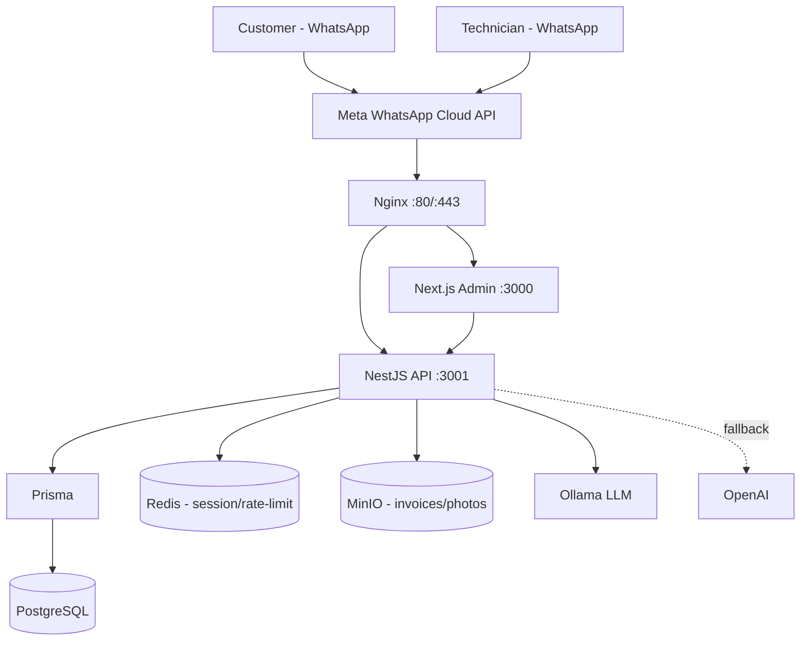
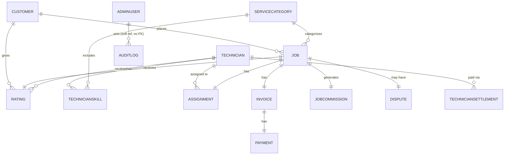

# Sevagan — Repository Analysis Report

**Date:** 2026-07-14
**Scope:** Full repository audit per `docs/ANALYZE.md` — backend (NestJS), frontend (Next.js 15), database (Prisma/Postgres), AI dispatcher, messaging, infra, tests, security.
**Method:** Direct source inspection (not doc claims). Every finding below was verified against code; where `docs/EXECUTION_PLAN.md` or other docs make a claim, it is explicitly checked against the codebase rather than trusted.

---

## Sprint 1 Status (Updated 2026-07-14)

All five Sprint 1 items (see "Next Sprint Plan" below) are closed. The rest of this report is left as the original point-in-time audit.

1. ✅ **Invoices route-prefix bug** — fixed (`admin/invoices.controller.ts` now matches every other admin controller); added a regression test asserting the controller's route metadata.
2. ✅ **nginx port mismatch** — `infrastructure/nginx/nginx.conf` upstream now targets `api:3001`, matching the container's actual port.
3. ✅ **docker-compose secrets** — the hardcoded WhatsApp credentials were moved to a gitignored root `.env`; `docker-compose.yml`'s fallbacks reverted to empty. See `docs/SECURITY_REVIEW.md` known-gap #6. **Action still needed from you:** confirm whether those credentials were ever live against the real Meta Cloud API and rotate them if so.
4. ✅ **e2e Redis lifecycle failure** — root-caused and fixed (see `docs/SECURITY_REVIEW.md` known-gap #5); also fixed an unrelated, date-dependent flaky test in `invoice.service.spec.ts` discovered while getting the suite green. Both `backend/test/*.e2e-spec.ts` suites pass.
5. ✅ **CI pipeline** — `.github/workflows/ci.yml` added (backend: prisma generate, lint, `test:cov` enforcing the 80% gate, build; frontend: lint, build). Uncovered and fixed two blockers along the way: neither the backend nor frontend had a working ESLint config (`eslint.config.js` / `eslint.config.mjs` added — pre-existing `any`/unused-var/hook-dep issues left as warnings, not rewritten).

---

## Executive Summary

1. **Current completion:** Docs mark Phases 0–12 (13 of 14 planned phases) ✅ COMPLETE and Phase 13 (Production Deployment) ❌ not started. Code inspection **substantiates the bulk of that** — this is a real, working product, not a scaffold — but surfaces several concrete bugs and gaps the phase sign-offs missed. Functional MVP completion: **~80%**. Production-readiness: **far lower (see score below)**.
2. **What works today:** End-to-end WhatsApp flows for customers (request → track → cancel → rate) and technicians (offer → accept/reject → start → complete → photo upload) via a Redis-backed conversation state machine; auto commission/trust-score/settlement calculation; rule-based technician assignment with reassignment-on-rejection; bilingual (EN/TA) messaging via a real `TranslationService`; PDF invoicing + WhatsApp delivery; a working admin dashboard (JWT auth, KPIs, CRUD on customers/technicians/jobs/settlements/commission/disputes, reports with charts); a genuine Ollama-primary/OpenAI-fallback LLM layer for intent classification and FAQ; RBAC + audit logging + rate limiting; 56 backend unit-test suites with an 80%-threshold Jest gate.
3. **Biggest risks:**
   - **Live-looking WhatsApp API credentials (access token, app secret, webhook verify token) are hardcoded as fallback values in the currently-modified, uncommitted `docker-compose.yml`** — the committed `HEAD` version has empty defaults. If this is committed/pushed, real credentials land in git history. Needs verification and, if real, rotation.
   - `admin/invoices.controller.ts` hardcodes an `api/v1` prefix on top of the global prefix + URI versioning already applied in `main.ts` — likely produces `/api/v1/api/v1/admin/invoices`, breaking that entire controller's routes in production-style routing.
   - `nginx.conf` proxies to `api:3002` while `docker-compose.yml`/backend expose `3001` — the reverse proxy as configured would not reach the API.
   - Frontend stores JWTs in `localStorage` with **no route middleware** (protection is a client-side `useEffect` redirect only) and never uses the refresh token the backend already supports — session security and session length are both weaker than the backend design intends.
   - Zero CI/CD of any kind; the 80% coverage gate and lint only run if a developer remembers to run them locally.
4. **Highest-priority missing functionality:** Production deployment itself (Phase 13 — EC2, TLS, DNS, monitoring, backups all unstarted); an escalation-to-human path when the assignment engine exhausts retries (currently just a customer-facing "please wait" message); frontend session/middleware hardening; CI pipeline.
5. **Recommended next three sprints:** (1) Fix the four concrete bugs/risks above + get e2e green + stand up CI; (2) Frontend hardening (middleware, refresh flow, shared components, a11y) + audit-log UI + escalation path; (3) Phase 13 production deployment (EC2, TLS, backups, monitoring) gated on sprint 1–2 closing out.
6. **Recommended implementation order:** Security/bug fixes → CI → frontend hardening → production deployment. Do not deploy before the invoice-route bug and nginx port mismatch are fixed — both would surface immediately in production traffic.
7. **Architecture improvements:** Standardize admin controllers on their sibling repositories (several bypass them and call `PrismaService` directly); decompose the two ~600-line bot services; add a shared frontend component library instead of five copies of the same table/pagination/modal.
8. **Production readiness score: 48/100** (see full breakdown in the Production Readiness section).
9. **Go/No-Go:** **Go, conditionally.** The core product logic is genuinely solid and well-tested. Do **not** proceed to Phase 13 deployment until the P0 items in the Gap Analysis are closed — none are large, but each would cause a visible production failure or security incident if shipped as-is.

---

## Repository Overview

```
backend/    NestJS 10.4.15 API — 19 feature modules + 7 infra modules, all wired into AppModule
frontend/   Next.js 15 (App Router) admin dashboard — 8 pages, client-rendered, axios-based
docs/       BRD, FRD, architecture, API spec, execution plan, security review, deployment guide
infrastructure/ nginx config
.claude/    project context, coding standards, workflow rules, ADRs, task backlog
docker-compose.yml   postgres, redis, minio, ollama, api, web, nginx
```

- **Backend**: 92 non-spec source files, 56 `*.spec.ts` unit-test files, 2 e2e specs. Prisma 6.9, Jest 29.7, `@nestjs/throttler`, `@nestjs/terminus`, `bcryptjs`, `passport-jwt`, `pdfkit`, `minio`, `ioredis`, `helmet`.
- **Frontend**: Next 15.3.3, React 19, Tailwind 3.4, `recharts`, `axios`. No test runner at all (no jest/vitest/playwright in devDependencies).
- **New/untracked since last commit** (per `git status`): `backend/src/infrastructure/ai/` (Ollama/OpenAI providers), `backend/src/infrastructure/audit/` (audit logging), `backend/prisma/migrations/20260630163120_add_audit_log/`, `docs/SECURITY_REVIEW.md` — these are real, wired-in features, not stubs left mid-work.
- **CI/CD**: confirmed absent — no `.github/workflows`, no other CI config anywhere in the repo.

---

## Architecture Assessment

**Pattern:** Layered/Clean-Architecture-lite monolith — Controllers → Services → Repositories (Prisma) → Domain (enums, zero deps) → Infrastructure (DB/cache/storage/i18n/messaging/AI/audit, all `@Global()`).

**Stack:** NestJS backend, Next.js 15 App Router frontend, PostgreSQL (Prisma ORM), Redis (conversation state + rate-limit state), MinIO (S3-compatible object storage for invoices/photos), Ollama (local LLM, `qwen3`) with OpenAI as fallback, Meta WhatsApp Cloud API (real integration, not a stub), Nginx reverse proxy (TLS block currently commented out — dev-only).



**Deviation found from `docs/ARCHITECTURE.md`:** nginx is documented as proxying to the API on port 3001, but `infrastructure/nginx/nginx.conf` actually targets `api:3002` — a live config mismatch, not just doc drift (see Risks).

---

## Feature Inventory

| Feature | Status | Evidence / Notes |
|---|---|---|
| Customer Module | ✅ Implemented | Bot flows (`customer-bot.service.ts`) + admin CRUD (list/detail/patch) |
| Technician Module | ✅ Implemented | Bot workflow (`technician-bot.service.ts`) + admin CRUD + skills management |
| Job Module | ✅ Implemented | Full lifecycle NEW→ASSIGNED→ACCEPTED→IN_PROGRESS→COMPLETED/CANCELLED; admin list/detail/assign/cancel |
| Dispatcher (assignment) | ⚠️ Partial | Rule-based matching + ranking (trustScore, rating) works; no distance/ETA weighting, no escalation to a human when retries exhaust |
| Operations Dashboard | ⚠️ Partial | KPIs + 7 entity pages implemented; no audit-log page, no dispatch board/kanban, no admin-user management UI |
| Authentication | ⚠️ Partial | Backend JWT+refresh solid; frontend never calls the refresh endpoint and stores tokens in `localStorage` with no middleware |
| Authorization | ⚠️ Partial | RBAC (`@Roles`/`RolesGuard`) gates only financial/config mutations; OPERATOR has broad write access by design; no admin-user management endpoints at all |
| Notifications | ✅ Implemented (WhatsApp only) | Real Meta Cloud API integration; no email/SMS/push channel exists |
| Payments | ⚠️ Partial | Cash/UPI recording + Razorpay payment-link generation work; no Razorpay webhook — UPI payment confirmation is manual (admin clicks confirm) |
| Reports | ✅ Implemented | Revenue/jobs/technician reports, charts, CSV export |
| AI Agents | ⚠️ Partial | Real LLM layer (Ollama→OpenAI) for intent classification, FAQ, category mapping, language detection; no "Operations Assistant"; assignment engine has zero AI involvement despite the phase name |
| Conversation Engine | ✅ Implemented | Redis-backed FSM, mature, well-tested, drives both bots |
| Knowledge Base | ❌ Missing | FAQ answers are static canned i18n strings keyed by classified intent — no retrieval/vector store/document QA |
| Audit Logging | ✅ Implemented (new) | `AuditLog` model + `AuditService`, wired into 11 mutations, admin-only read endpoint; **no DB indexes** on a table that's always filtered/sorted |
| Analytics | ⚠️ Partial | Revenue/jobs/technician performance only; no funnel/retention/cohort analytics |

---

## AI Dispatcher Assessment

The phase name "AI Dispatcher" overstates what exists at the repo level: the LLM layer is real and wired end-to-end, but it is a **narrow NLU/FAQ assist**, not an AI-driven dispatch engine. Job-to-technician matching is 100% deterministic.

| Concept | Verdict | Detail |
|---|---|---|
| Customer Assistant | EXISTS (hybrid) | Rule-based FSM with a narrow LLM fallback (`tryAiDispatch()`) for free text in `IDLE`/`AWAITING_SERVICE` only; pure-digit input never reaches the LLM |
| Dispatcher | EXISTS, rule-based | `AssignmentEngineService.findBestTechnician` — Prisma filter (skill, AVAILABLE, service-area substring match) + `orderBy [trustScore desc, rating desc]`, `findFirst` |
| Technician Assistant | EXISTS, no AI | `technician-bot.service.ts` is a pure state machine, zero LLM calls |
| Operations Assistant | MISSING | No admin-facing bot/assistant anywhere |
| Memory | MISSING | No vector store/embeddings; only 24h-TTL Redis conversation state, no long-term preference memory |
| Prompt Templates | PARTIAL | Inline `SYSTEM_PROMPT` constants per service; no shared/reusable template module |
| Decision Engine | PARTIAL | NLU decisions (intent/category/language) are LLM-based with confidence gating; the actual assignment "decision" is a deterministic SQL sort |
| Matching Logic | EXISTS | Category + service-area substring + availability filter |
| Ranking Logic | PARTIAL | Two-key sort only (trustScore, rating) — no distance/ETA/workload weighting |
| Fallback Logic | EXISTS | Ollama→OpenAI; AI-dispatch→standard menu; reassignment on rejection (max 3) |
| Escalation Logic | MISSING | Retry exhaustion only sends the customer a "please wait" message — no admin/ops alert or human handoff |
| Confidence Scoring | PARTIAL | Present in NLU (`IntentResult.confidence`, category match ≥0.6 gate); absent from the assignment engine |

**i18n rule violation found:** WhatsApp interactive-button titles ("Accept", "Reject", "English") are hardcoded English literals in `assignment-engine.service.ts` and `technician-bot.service.ts`, bypassing `TranslationService` — a direct violation of the project's non-negotiable multilingual rule. Low severity (button labels, not message bodies) but should be fixed.

---

## Database Review

16 Prisma models, 10 enums, 2 migrations (`20260614083731_init_full_schema`, `20260630163120_add_audit_log`). All core relations are modeled as 1:1 via unique FK on the child (Job↔Assignment/Invoice/JobCommission/Rating/Dispute), which is clean and correct for this domain.



**Findings:**
- `AuditLog` has **no indexes at all**, yet `AuditService` always filters by `entityType`/`actorId` and orders by `createdAt` — will degenerate to a full table scan as the table grows.
- `TechnicianSettlement` has no FK to `Job`/`JobCommission` — settlements aggregate by `technicianId` only, so the jobs composing a given settlement can't be reconstructed after the fact.
- Missing indexes: `Assignment.assignedAt/acceptedAt` (date-range queries), composite `Job(serviceCategoryId, status)` (dispatch-queue queries), `Invoice.status`/`Payment.status` (admin filters), `Rating.customerId` (asymmetric — only `technicianId` is indexed).
- `Rating.rating` is a bare `Int` with no 1–5 CHECK constraint at DB or Prisma level.
- No soft-delete pattern anywhere; all FKs are `ON DELETE RESTRICT`, so e.g. deleting a customer with jobs is blocked at the DB layer rather than modeled.
- `AuditLog.entityId`/`actorId` are unconstrained strings (no FK) — intentional soft-reference design, but means orphaned/typo'd references are possible and unindexed.
- Seed data (`prisma/seed.ts`): 8 service categories, CASH (₹20 flat) + UPI (5%) commission rules, one default admin (with an explicit "change this password" warning).

---

## API Review

14 controllers, global `JwtAuthGuard` + `ThrottlerGuard` + `RolesGuard` chain, global `ValidationPipe` (whitelist/forbidNonWhitelisted/transform), global `HttpExceptionFilter`.

**Confirmed bug:** `admin/invoices.controller.ts` declares `@Controller('api/v1/admin/invoices')` while `main.ts` already applies a global `api` prefix + `v1` URI versioning, and every other controller omits the prefix. This almost certainly double-prefixes routes to `/api/v1/api/v1/admin/invoices`, breaking the entire invoices admin surface (list, detail, PDF redirect, confirm-payment) as deployed — needs a routing test to confirm and fix.

Other notes:
- Feature modules split unevenly: `auth`, `dashboard`, `health`, `reports` own their controllers; `customers`, `technicians`, `jobs`, `service-categories`, `disputes`, `ratings`, `assignments` are repository-only, with their actual REST surface living in `admin/*.controller.ts` — several of which inject `PrismaService` directly instead of the sibling repository, an inconsistent data-access pattern.
- RBAC is applied only to financial/config mutations (commission rules, settlement generate/pay, invoice confirm-payment, dispute resolve, audit-log read); technician/customer/job mutations have no `@Roles()` — matches the documented Phase 12 intent but means any authenticated OPERATOR has broad write access.
- WhatsApp webhook GET (Meta handshake) has no signature guard — verified only via `hub.verify_token` query param comparison, which is correct per Meta's spec, but worth knowing it's a different trust model than the HMAC-guarded POST.
- `WebhookHmacGuard` silently bypasses verification in non-production when `WA_APP_SECRET` is unset — intentional dev convenience, real footgun if `NODE_ENV` is misconfigured in a deployed environment.

---

## UI Review

| Page | Status | Notes |
|---|---|---|
| Login | Implemented | Email pre-filled with the seed admin address — minor info leak |
| Dashboard | Implemented | KPI cards, 30s auto-poll, loading/error states |
| Customers | Implemented (read-only) | No search/filter (unused `Search` icon import), no detail/drill-down page |
| Technicians | Implemented | Create modal + skills; no edit/deactivate action, no detail page |
| Jobs | Partial | Flat filterable table only — no dispatch board/kanban, no manual-reassign action |
| Settlements | Implemented | Technician ID entered as a raw UUID — no picker |
| Commission | Implemented | CRUD-lite for rules |
| Disputes | Implemented | Resolution notes captured via native `prompt()` — no modal, poor a11y |
| Reports | Implemented | Charts + CSV export per section |
| Audit Logs | **Missing** | Backend endpoint exists; no frontend route/nav entry at all |

**Findings:**
- **Auth**: tokens in `localStorage`; refresh token is fetched but **never used** — no refresh flow implemented despite the backend supporting it; **no `middleware.ts`** anywhere — route protection is a client-side `useEffect` redirect, so protected content briefly mounts before redirecting.
- **No shared component library** (`src/components` doesn't exist) — table/pagination/modal/status-badge markup is duplicated near-identically across 5 pages.
- **Zero accessibility attributes** anywhere in `src/app` (no `alt`, `aria-*`, `role`); icon-only buttons have no labels.
- **No i18n on the admin UI itself** — Tamil support is decorative only (a splash-page glyph); the dashboard is English-only, multilingual UX lives entirely on the WhatsApp side.
- **No frontend tests** of any kind (no jest/vitest/playwright in devDependencies).
- Dead dependency: `@tanstack/react-table` installed but unused (all tables are hand-rolled).
- Custom Tailwind "saffron"/brand palette exists but is unused on real admin pages (only the splash page uses it) — brand inconsistency.

---

## Code Quality Assessment

- **God services**: `customer-bot.service.ts` (639 lines) and `technician-bot.service.ts` (526 lines) mix conversation state, DB writes, and commission/invoice/dispute/rating side effects in one class each — candidates for decomposition into smaller collaborators.
- **Inconsistent data-access pattern**: some admin controllers use their module's repository, others call `PrismaService` directly, bypassing the abstraction other modules rely on.
- **TranslationService discipline is otherwise good** — the one real violation is the hardcoded WhatsApp button titles noted in the AI Dispatcher section, plus a few hardcoded fallback literals (`'Customer'`, `'ASAP'`) that are low-severity but technically bypass i18n.
- **Ad hoc error handling**: per-step `try/catch` + `logger.error` + continue, rather than a consistent Result/error-boundary pattern in the bot services — pragmatic, but inconsistent.
- No raw SQL anywhere (`$queryRaw`/`$executeRaw` confirmed absent) — good.

**Technical debt, by severity:**

| Item | Severity |
|---|---|
| WhatsApp secrets hardcoded in uncommitted `docker-compose.yml` | **Critical** |
| Invoices controller double route-prefix (likely broken routes) | **Critical** |
| nginx→API port mismatch (3002 vs 3001) | **High** |
| Frontend: localStorage tokens, no middleware, no refresh flow | **High** |
| No CI/CD anywhere | **High** |
| e2e suite (`whatsapp-flow.e2e-spec.ts`) fails locally, unresolved | **Medium** |
| `AuditLog` table has no indexes | **Medium** |
| `manualAssign` DTO accepts `technicianId` but engine ignores it, re-runs generic matching | **Medium** |
| Hardcoded i18n bypass on WhatsApp button titles | **Low** |
| No shared frontend component library (duplicated markup) | **Low** |
| Zero frontend accessibility attributes | **Low** |
| `TechnicianSettlement` has no traceable link to source jobs/commissions | **Low** |
| Backend Docker image runs as root, no HEALTHCHECK | **Low** |

---

## Risks

1. **Secret exposure**: live-looking Meta WhatsApp credentials sitting in an uncommitted, modified `docker-compose.yml` — must be verified/rotated and kept out of git history.
2. **Silent production breakage**: the invoices route bug and nginx port mismatch would both surface as real outages/404s immediately upon deployment, not edge cases.
3. **Session security**: frontend token handling (localStorage, no middleware, no refresh) is weaker than the backend's design anticipates — XSS would be sufficient to steal a live session, and sessions can't be silently renewed, forcing either short-lived UX friction or a security/UX tradeoff no one has resolved.
4. **No CI**: every quality gate (lint, 80% coverage, tests) is opt-in per developer; regressions can merge silently.
5. **No monitoring/backups**: Phase 13 gaps mean a production incident today would have no alerting and no recovery path.
6. **Assignment engine has no escalation path**: if no technician is ever found, the customer is left with a static message and there's no operational visibility into stuck jobs.

---

## Production Readiness

| Area | Score (0–10) | Notes |
|---|---|---|
| Security | 6 | Real RBAC/HMAC/rate-limiting/audit-log, but a live secret sitting in the working tree and hardcoded JWT fallback secrets |
| Monitoring | 2 | Only `/health` + `/health/liveness`; no APM, no structured logging, no alerting |
| Logging | 3 | Nest's default Logger only; no structured/JSON logs, no log aggregation |
| Observability | 2 | No metrics, no tracing |
| CI/CD | 0 | Confirmed absent |
| Configuration management | 5 | Env-driven, validated, but several security-relevant defaults are silently permissive |
| Secrets | 3 | `.env` correctly gitignored, but a real secret leak risk found in the working tree |
| Deployment | 1 | Docker Compose works locally; Phase 13 (EC2/TLS/DNS) not started; nginx config itself has a bug |
| Backup/Recovery | 0 | Documented in prose only, nothing implemented |
| Scalability | 5 | Reasonable layering, but no load testing anywhere, some missing indexes for scale |

**Overall: 48/100.** The application layer is well ahead of the operational layer — this reads as a team that shipped features fast with real test discipline, but has not yet done a hardening/deployment pass.

---

## Gap Analysis & Prioritized Roadmap

### P0 — before touching production
- Verify and remove the hardcoded WhatsApp credentials from `docker-compose.yml`; rotate if real.
- Fix `admin/invoices.controller.ts` route-prefix bug.
- Fix nginx `api:3002`/`3001` port mismatch.
- Set real `JWT_SECRET`/`JWT_REFRESH_SECRET`/`RAZORPAY_LINK_URL` for any non-dev environment.
- Fix the failing `whatsapp-flow.e2e-spec.ts` Redis lifecycle issue — currently no reliable e2e gate.

### P1 — MVP quality bar
- Add a CI pipeline (lint + test + coverage gate) — currently zero automation.
- Frontend: add `middleware.ts` route protection; implement the refresh-token flow that already exists server-side; move off `localStorage` or accept and document the tradeoff.
- Build the audit-log admin page (backend already supports it).
- Fix the WhatsApp button-title i18n bypass ("Accept"/"Reject"/"English").
- Add an escalation-to-human path when the assignment engine exhausts retries.
- Add indexes to `AuditLog` (`entityType`, `actorId`, `createdAt`).
- Backend Dockerfile: non-root user + `HEALTHCHECK`.

### P2
- Shared frontend component library (table/pagination/modal currently duplicated 5×).
- Frontend accessibility pass (currently zero `aria-*`/`alt`/`role`).
- Admin-user management endpoints + UI (currently seed/DB-only provisioning).
- Razorpay webhook for automatic UPI payment confirmation (currently manual).
- Structured logging + basic APM/alerting.
- Technician/customer detail pages; a real dispatch board view.
- Fix `manualAssign` so it actually targets the specified technician instead of re-running generic matching.

### P3
- Retrieval-based FAQ/knowledge base (currently static canned answers).
- Distance/ETA-aware ranking in the assignment engine.
- Dependency cleanup (`@tanstack/react-table` unused; `recharts` transitive vulnerabilities).
- Frontend brand-color consistency (custom Tailwind palette unused on real pages).

### Milestones

| Milestone | Objective | Key items |
|---|---|---|
| M1 — Stabilize | Close every P0 | Route bug, nginx bug, secrets, e2e fix |
| M2 — Harden | Close P1 | CI, frontend auth hardening, audit UI, escalation path |
| M3 — Deploy (Phase 13) | Production launch | EC2, TLS, DNS, backups, monitoring, runbook |
| M4 — Polish | Close P2/P3 | Shared components, a11y, KB/RAG, ranking improvements |

---

## GitHub Backlog (abbreviated)

- **Epic: Production Stabilization** — Fix invoices route prefix; fix nginx port; purge/rotate leaked secrets; fix e2e Redis issue. (13 pts)
- **Epic: CI/CD** — GitHub Actions: lint, test, coverage gate, Docker build. (8 pts)
- **Epic: Frontend Session Hardening** — middleware.ts; implement refresh flow; reconsider token storage. (13 pts)
- **Epic: Audit & Escalation** — Audit-log admin page; AuditLog indexes; assignment escalation alert. (8 pts)
- **Epic: Phase 13 Deployment** — EC2 provisioning; TLS; DNS; backups; Uptime Robot; runbook. (21 pts)
- **Epic: Frontend Quality** — Shared components; accessibility pass; detail pages; dispatch board. (21 pts)
- **Epic: Knowledge Base / AI Improvements** — RAG-based FAQ; ranking weights; confidence scoring in dispatch. (13 pts)

---

## Next Sprint Plan (Sprint 1)

1. Reproduce and fix the invoices route-prefix bug; add a routing test.
2. Fix the nginx `api` upstream port.
3. Confirm whether the `docker-compose.yml` secrets are real; rotate if so; scrub from working tree before any commit.
4. Debug and fix `whatsapp-flow.e2e-spec.ts`'s Redis connection lifecycle issue.
5. Stand up a minimal GitHub Actions workflow: install, lint, `test:cov` (enforcing the existing 80% gate), `next build`.

Acceptance: all four bugs closed with a regression test each; CI green on a fresh PR; e2e suite passes locally and in CI.
